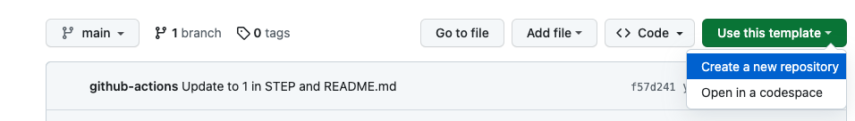
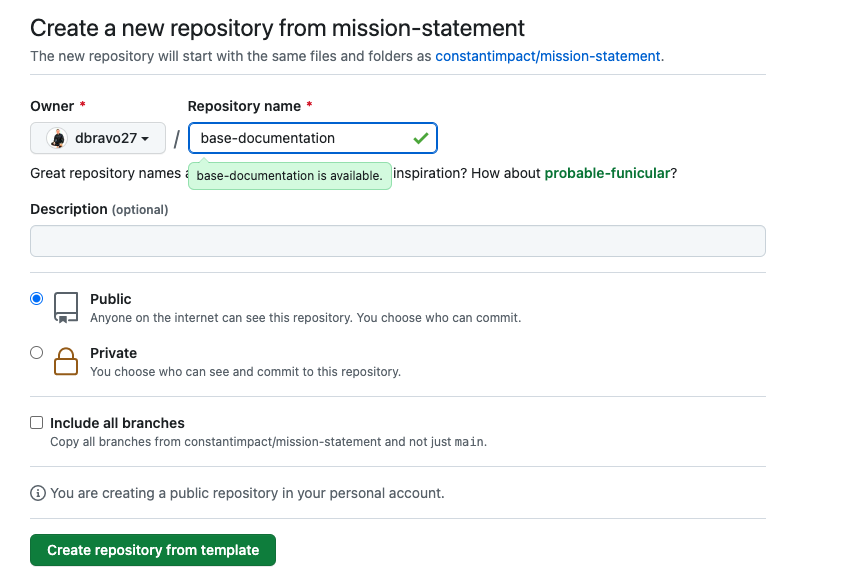

<!-- 
  <<< Author notes: Header of the course >>> 
  Include a 1280×640 image, course title in sentence case.
  In your repository settings: enable template repository, add your 1280×640 social image, auto delete head branches.
  Add your open source license.
-->

# README file
*Estimated course duration: 45 minutes.*

<h2>Welcome</h2>

Welcome to the **README file** training.

Prepare to enhance your Data Science projects. In this training, you'll learn the art of composing a good looking README file. 

### Problem

As a Data Scientist, you're eager to share your project with the wider organization and spark collaboration. Unfortunately, potential contributors are scratching their heads, struggling to grasp the project's objectives, usage, or determine if new features fit the bill. Additionally, it looks like no one is actively maintaining the project. 

### Solution

Make the onboarding experience to your project a smooth, self-service journey by including answers to those common questions in a user-friendly document called **README file** at the beginning of your project repository. 

In this training you'll explore README files, templates and step-by-step instructions. With these resources, you'll be able to create a top-notch README file that empowers your community to dive right in, collaborate, and contribute to your project's success.

### Training Overview

- **Who is this for:** Data science rockstars looking to level up their project communication.
- **What you'll learn:** You'll master the art of getting your project's goals and usage across instantly by crafting effective README files for Data Science projects.
- **What you'll build:** By the end of the course, you'll have whipped up a slick README file that turns heads for one of your projects.
- **Prerequisites:** [Intro to GitHub](https://github.com/skills/introduction-to-github) training (README.md file, commits & pull requests).
- **How long:** This course will progress over 3-steps and should take less than 45 minutes to complete.

### How to start this training

1. Click on **Use this template** (the green button above).

2. In the dropdown menu select **Create a new repository** and follow the prompts to create a new repository.

   - Choose your personal account to host the repository.
   - Create a public repository, so the Accelerator team can track your porgress.
   - Name the repository something easy for you to recognize and remember.

3. After your new repository is created, wait about 20 seconds, then refresh your new repository page. Follow the step-by-step instructions in the new repository's README file.

<!-- 
  <<< Author notes: Step 1 >>> 
  Choose 3-5 steps for your course.
  The first step is always the hardest, so pick something easy!
  Encourage users to open new tabs for steps!
-->

<h2>Step 1: README exercise</h2>

**What is a README file?**

> A README file is vital for any repository. This Markdown document contains key project information like purpose, features, installation, data, methodology, results, usage, contributions, contacts, license, and acknowledgments. A well-organized README enhances user engagement and understanding.

The open-source universe has seen an incredible boom in recent years, with projects skyrocketing in both numbers and awesomeness, and guess what? All those truly amazing projects have one thing in common: an awesome README! 🌟

You land on the project page, and boom! Within minutes, you're rockin' and rollin' with your very own version of the project. 🚀

Tons of contributors, heaps of pull requests, and frequent updates galore – what's the secret sauce? You guessed it, an outstanding README! 📚

New developers? No problem! They'll find all the juicy details to get started, like easy-peasy install instructions and helpful contributing guides. 🛠️

And what about new users? They'll discover how the project is being used, complete with informative screenshots and super cool demos! 🎮

So let's keep those READMEs rockin' and make the InnerSource in Shell even more incredible, one project at a time! 🌍🤘

### :keyboard: Activity:

1. Click on the links provided below to access different README files from various Data Science related projects.
2. Skim through each README, taking note of the overall structure, organization and it's position in the repo's structure.
3. Identify common sections across the files, such as project title, installation instructions, usage, and contribution guidelines.
4. Pay close attention to the writing style used in each README. Is it instructional, educational, friendly, clear, concise, or hard to read?
5. Jot down your observations and thoughts on what makes each README effective or ineffective. Consider aspects like visual appeal, ease of understanding, and the presence of examples or demos.
6. Once you've gone through all the README files, reflect on your findings and think about how you can apply these insights to create an awesome README for your own projects.

Ready, set, explore! Let the README adventure begin! 🕵️‍♀️🔍

1. [Open Flamingo](https://github.com/mlfoundations/open_flamingo#readme)

2. [Auto-GPT](https://github.com/Significant-Gravitas/Auto-GPT#readme)

3. [MiniGPT-4](https://github.com/Vision-CAIR/MiniGPT-4#readme)

4. [Dolly 2.0](https://github.com/databrickslabs/dolly/tree/master/data)

5. [Streamlit](https://github.com/streamlit/streamlit#readme)

<h2>Step 2: README research</h2>

*Great job reading those README files* :tada:

**What is an InnerSource pattern?** 

In InnerSource, patterns are best practices that solve problems in a given context, guiding teams to avoid pitfalls and enhance productivity. This section introduces key InnerSource patterns relevant to this training's goals. For each pattern, we provide a brief description and a link to further resources.

### :keyboard: Activity:

1. Click on this [link](https://patterns.innersourcecommons.org/p/base-documentation) to dive into the valuable insights prepared by the InnerSource community on crafting top-notch Base Documentation for your projects. Skim through the page to discover their expert tips and tricks.
2. Click on this [link](https://patterns.innersourcecommons.org/appendix/extras/readme-template) and uncover a template from the InnerSource community, specially designed to help you structure your README file. 
3. Once you've gone through the InnerSource documentation, reflect on your findings and think about how you can apply these insights to create an awesome README for your own projects.

<h2>Step 3: README Hands-on</h2>

*Nice work reading the documentation* :blue_book:

It's time for you to whip up an awesome README for your Data Science Project! 🚀

### :keyboard: Activity:

1. Start by opening the README.md file in your project. If you're new to GitHub, or your project doesn't have a GitHub repo or README.md file yet, you'll want to check out the [Intro to GitHub training](https://github.com/skills/introduction-to-github) training to get up to speed.

2. Now it's time to get creative and put all the knowledge you've gathered to good use! Craft a comprehensive README file for your project, starting with the purpose, highlighting it's importance and why people should pay attention to it, contribute, and use it. Be sure to also include installation instructions, and contribution guidelines. This way, new contributors can quickly understand your project and dive right in.

4. Once you've polished your README, save, commit, and push your changes. Not sure how to make commits and pushes? No worries! The [Intro to GitHub training](https://github.com/skills/introduction-to-github) has got your back.

<!-- 
  <<< Author notes: Finish >>> 
  Review what we learned, ask for feedback, provide next steps.
-->

<h2>Finish</h2>

_Congratulations, you've completed this training!_ :tada:

Here's a recap of your accomplishments:

- You learned about README files.
- You created a README file for your project with a good Mission Statement & Value Proposition.
- You made the README file available for new contributors. 

### What's next?

To keep growing your InnerSource skills, be sure to follow the Learning Path you've created for yourself. Here are the next trainings in line:

1. WIP
2. WIP
3. WIP
4. WIP
5. WIP

Choose the next training in line on your learning path and keep up the fantastic work! 🚀📚

Check out these resources to learn more or get involved:
- WIP
- WIP
- WIP
- WIP

<!--
  <<< Author notes: Footer >>>
  Add a link to get support, GitHub status page, code of conduct, license link.
-->

---

Get help: [Post in our discussion board](https://github.com/skills/.github/discussions) &bull; [Review the InnerSource Maturity Accelerator status page](https://www.githubstatus.com/)

&copy; 2022 GitHub &bull; [Code of Conduct](https://www.contributor-covenant.org/version/2/1/code_of_conduct/code_of_conduct.md) &bull; [MIT License](https://gh.io/mit)
